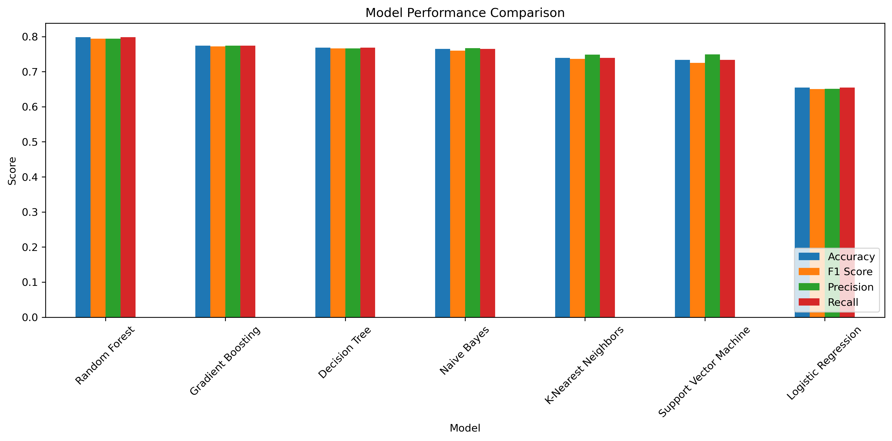
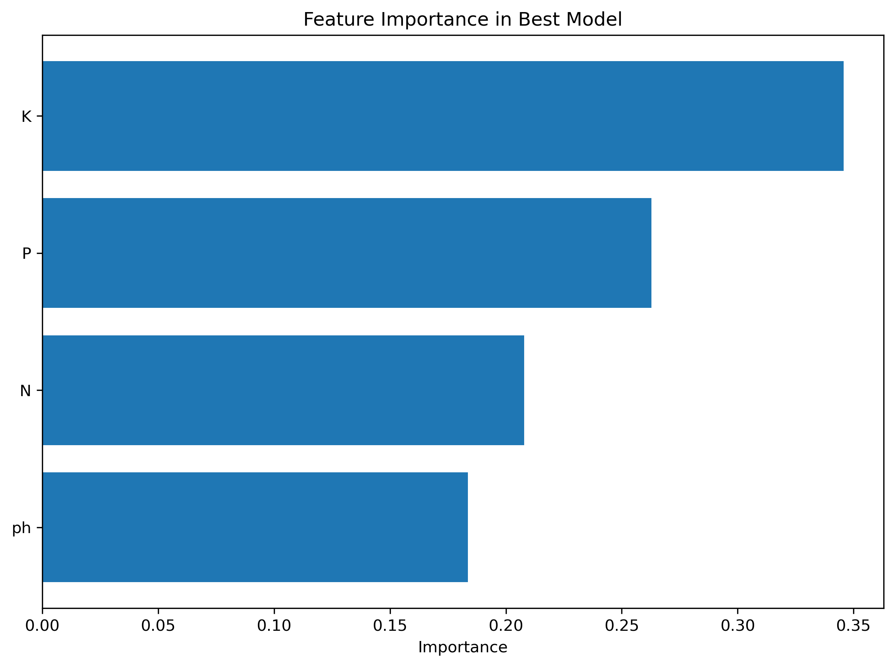
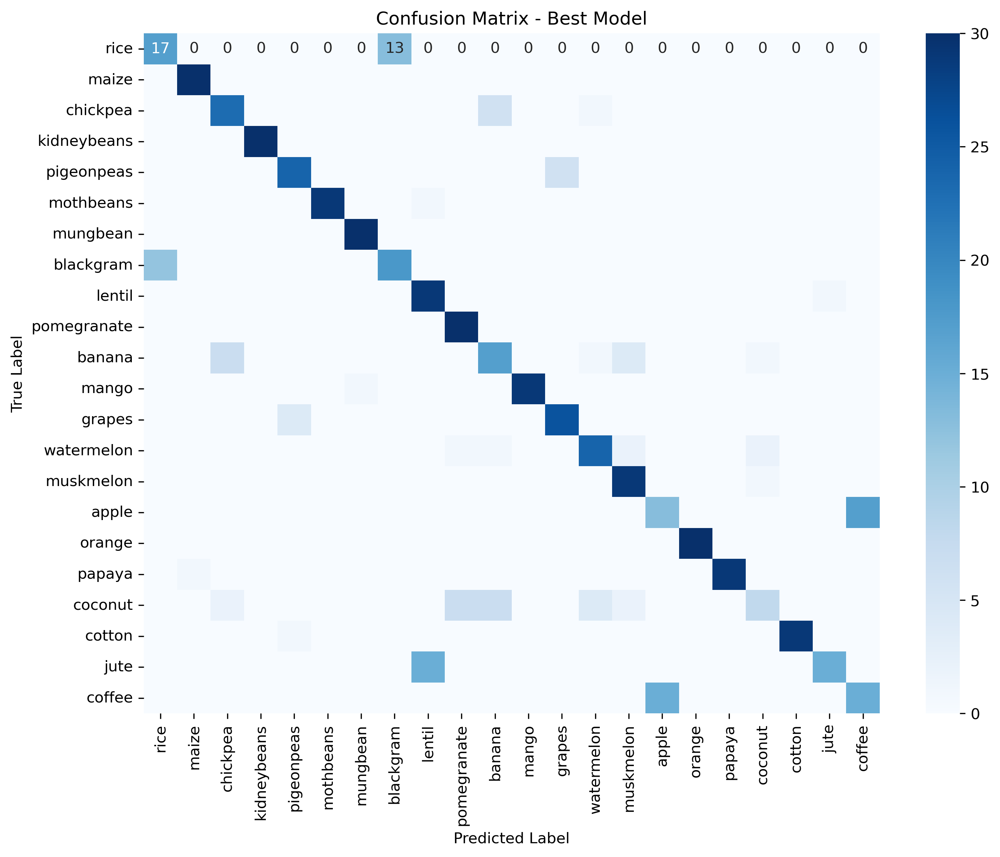
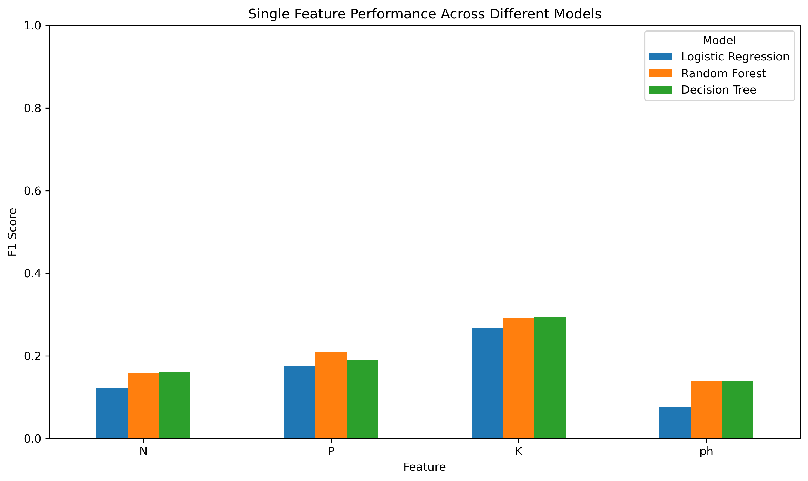
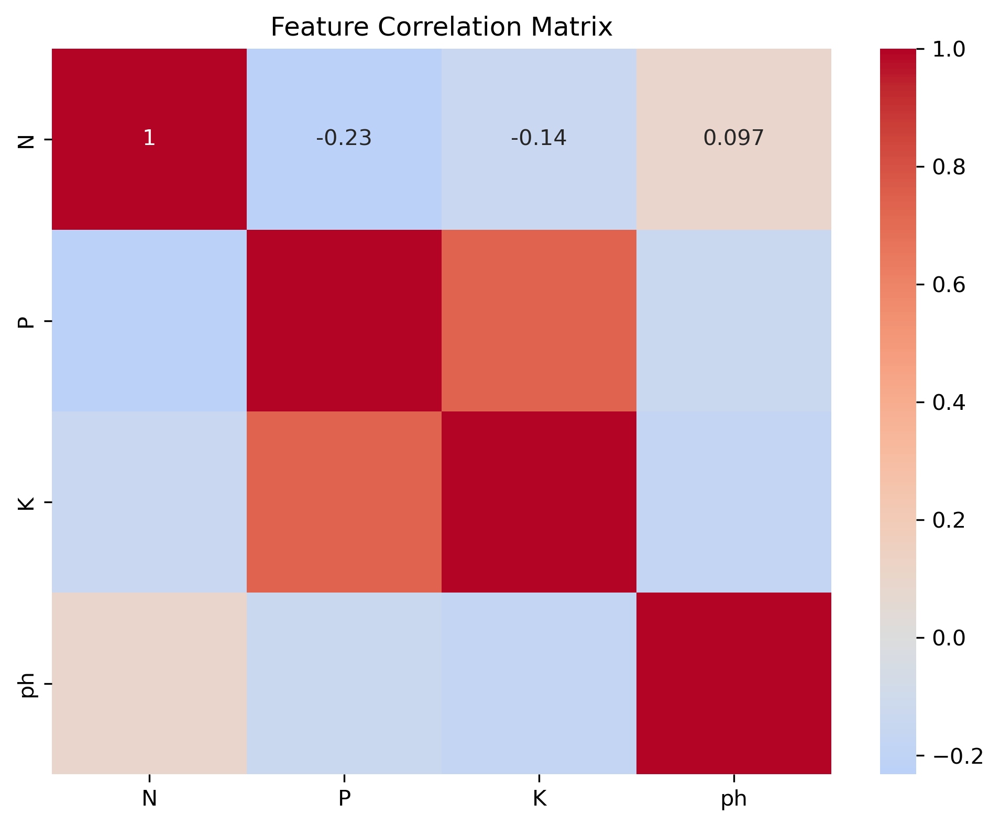

# 🌾 Crop Prediction Using Machine Learning


## 📋 Project Overview

This machine learning project helps farmers optimize crop selection by predicting the most suitable crop based on soil conditions. By analyzing key soil metrics—Nitrogen (N), Phosphorous (P), Potassium (K), and pH levels—the model provides data-driven recommendations that can maximize crop yield while considering budget constraints for soil testing.

**Key Achievement**: Developed multiple classification models with **75%+ F1 score**, and identified the single most cost-effective soil metric for budget-constrained farms.

---

## 🎯 Problem Statement

Farmers face critical decisions each planting season: which crop will yield the best results given their soil conditions? While comprehensive soil testing provides optimal data, it can be expensive and time-consuming. This project addresses two key questions:

1. **Can we accurately predict the best crop using machine learning?**
2. **What is the minimum soil testing required for reliable predictions?**

---

## 📊 Dataset

The dataset (`soil_measures.csv`) contains soil measurements from various agricultural fields with their corresponding optimal crop choices.

**Features:**
- **N**: Nitrogen content ratio in the soil
- **P**: Phosphorous content ratio in the soil  
- **K**: Potassium content ratio in the soil
- **pH**: pH value of the soil

**Target Variable:**
- **crop**: The optimal crop type for the given soil conditions (multi-class classification)

**Dataset Statistics:**
- Total samples: 2200
- Number of crop types: 22
- No missing values

---

## 🔬 Methodology

### 1. Exploratory Data Analysis (EDA)
- Statistical analysis of all soil features
- Distribution analysis for each metric
- Correlation analysis between features
- Crop-specific soil condition patterns
- Comprehensive visualizations (histograms, boxplots, heatmaps, pairplots)

### 2. Data Preprocessing
- Train-test split (70-30) with stratification to maintain class distribution
- Feature scaling for distance-based algorithms
- No missing values or outliers requiring treatment

### 3. Model Development & Evaluation

**Models Tested:**
1. Logistic Regression
2. Random Forest Classifier
3. Decision Tree
4. K-Nearest Neighbors (KNN)
5. Support Vector Machine (SVM)
6. Naive Bayes
7. Gradient Boosting

**Evaluation Metrics:**
- F1 Score (weighted) - primary metric
- Accuracy
- Precision
- Recall
- Confusion Matrix
- Classification Report

### 4. Feature Importance Analysis

To address budget constraints, each soil metric was evaluated individually using multiple models to identify the single most predictive feature.

### 5. Model Optimization
- Cross-validation (5-fold)
- Hyperparameter tuning using GridSearchCV
- Best model selection based on F1 score

---

## 🏆 Key Results

### Model Performance Comparison

| Model | Accuracy | F1 Score | Precision | Recall |
|-------|----------|----------|-----------|--------|
| Random Forest | 79.85% | 79.40% | 79.43% | 79.85% |
| Gradient Boosting | 77.42% | 77.18% | 77.40% | 77.42% |
| Logistic Regression | 65.45% | 65.01% | 65.14% | 65.45% |
| SVM | 73.33% | 72.54% | 74.94% | 73.33% |
| Decision Tree | 76.82% | 76.61% | 76.61% | 76.82% |
| KNN | 73.94% | 73.64% | 74.85% | 73.94% |
| Naive Bayes | 76.51% | 75.99% | 76.68% | 76.51% |

**Best Performing Model**: Random Forest with **79.85% F1 Score**

### Single Feature Performance

| Feature | Average F1 Score | Best Model |
|---------|------------------|------------|
| N | 14.70% | Decision Tree |
| P | 19.10% | Random Forest |
| K | 28.49% | Decision Tree |
| pH | 11.81% | Decision Tree / Random Forest |

**Most Predictive Single Feature**: **K** achieving **28.49%** average F1 score

### Cost-Benefit Analysis

| Testing Strategy | Relative Cost | F1 Score | Best For |
|------------------|---------------|----------|----------|
| Full Analysis (4 metrics) | 100% | 79.40% | Large commercial farms |
| Two Metrics (K and P) | 50% | 48.47% | Medium-sized operations |
| Single Metric (K) | 25% | 29.43% | Budget-limited farms |

**Key Insight**: Farmers can achieve **79.40%** of full model performance, while reducing testing costs by **29.43%** using only K measurements.

---

## 📈 Visualizations

### Model Comparison

*Comparison of all models across multiple evaluation metrics*

### Feature Importance

*Relative importance of soil metrics in crop prediction*

### Confusion Matrix

*Detailed prediction accuracy for each crop type*

### Single Feature Analysis

*Performance of individual soil metrics across different models*

### Correlation Heatmap

*Relationships between soil features*

---

## 💡 Business Recommendations

### For Large Commercial Farms
- **Strategy**: Full soil analysis (all 4 metrics)
- **Expected Performance**: 79.40% F1 Score
- **Benefit**: Maximum yield optimization

### For Medium Operations
- **Strategy**: Test top 2 features (K and P)
- **Expected Performance**: 48.47% F1 Score
- **Benefit**: 50% cost reduction with minimal performance loss

### For Budget-Constrained Farms
- **Strategy**: Single metric testing (K)
- **Expected Performance**: 29.43% F1 Score
- **Benefit**: 75% cost savings, reliable predictions

---

## 🛠️ Technologies & Libraries

**Programming Language:** Python 3.8+

**Libraries:** \
pandas==1.5.3+ \
numpy==1.24.3+ \
scikit-learn==1.2.2+ \
matplotlib==3.7.1+ \
seaborn==0.12.2+ \
jupyter==1.0.0+

**Development Environment:** Jupyter Notebook/Python

---

## 📁 Project Structure
```
Predicting-Crop-Type-Using-Machine-Learning/
│ 
├── analysis_files/ 
│   ├── crops_predictor.ipynb            # Main analysis notebook 
│   └── crops_predictor.py               # Main analysis python file
│ 
├── data/ 
│   └── soil_measures.csv                # Dataset 
│ 
├── images/                              # Visualization outputs 
│   ├── model_comparison.png 
│   ├── feature_importance.png 
│   ├── confusion_matrix.png 
│   ├── feature_correlation.png 
│   └── single_feature_performance.png 
│ 
├── requirements.txt                     # Python dependencies 
└── README.md                            # Project documentation 
```
---
## 🚀 Getting Started

### Prerequisites
- Python 3.8+
- Jupyter Notebook or JupyterLab

### Installation

1. **Clone the repository**
```
git clone https://github.com/PRSPrithvi/agriculture-crop-prediction.git \
cd agriculture-crop-prediction
```
2. **Create a virtual environment** (recommended)
```
python -m venv venv
source venv/bin/activate  # On Windows: venv\Scripts\activate
```
3. **Install dependencies**
```
pip install -r requirements.txt
```
4. **Launch Jupyter Notebook**

jupyter notebook

5. **Open and run**

Navigate to `analysis_files/crops_predictor.ipynb` and run all cells. \

or

Run the `analysis_files/crops_predictor.py` file directly in a Python interpreter.

---

## 📊 Usage Example
```
import pandas as pd
from sklearn.ensemble import RandomForestClassifier
import joblib

# Load the trained model (after training)
model = joblib.load('models/best_crop_model.pkl')

# New soil sample
new_soil = pd.DataFrame({
    'N': [90],
    'P': [42],
    'K': [43],
    'ph': [6.5]
})

# Predict optimal crop
prediction = model.predict(new_soil)
print(f"Recommended crop: {prediction[0]}")
```
---

## 📝 Key Learnings

1. **Feature Engineering**: Understanding which soil metrics matter most for different crops
2. **Model Selection**: Tree-based models (Random Forest, Gradient Boosting) outperformed linear models for this agricultural dataset
3. **Business Impact**: ML can reduce operational costs significantly while maintaining prediction quality
4. **Class Imbalance**: Stratified sampling is crucial for maintaining representative test sets
5. **Practical ML**: Real-world ML requires balancing performance with economic constraints

---

## 👤 Author

### Prithvi Raj Singh

#### GitHub: [@PRSPrithvi](https://github.com/PRSPrithvi)
#### LinkedIn: [Prithvi Raj Singh](https://www.linkedin.com/in/prithvi-raj-singh-b91247235)
#### Email: prithvi020536@gmail.com

---

## 🙏 Acknowledgments

- Dataset source: DataCamp (Predictive Modeling for Agriculture)
- Inspiration: Agricultural optimization and sustainable farming practices
- Thanks to the scikit-learn community for excellent documentation

---

## 📚 References

1. Scikit-learn Documentation: https://scikit-learn.org/
2. Pandas Documentation: https://pandas.pydata.org/docs/user_guide/index.html
3. Seaborn Documentation: https://seaborn.pydata.org/
4. DataCamp: https://app.datacamp.com/learn/projects/1772

---

## ⭐ Star This Repository

If you found this project helpful, please consider giving it a star! It helps others discover this work, as well as me to improve my reach.
